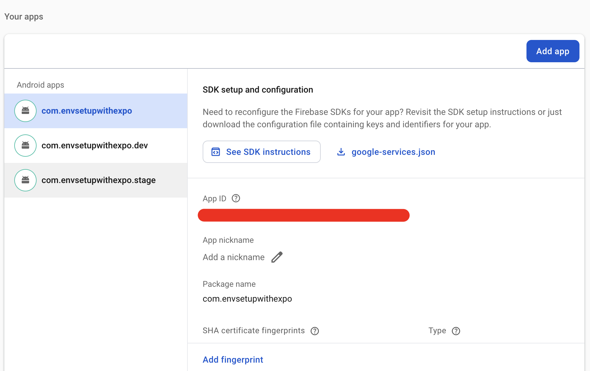

# Environment setup with Expo

This is an example repo showcasing a custom method to set up different environments in Expo, but without using EAS CLI.

The idea behind it is to use a [custom script](scripts/update_env.ts) which will update the environment variables in the `.env` file.

## Getting started

To get started you first need to install dependencies (I am using `yarn` version 4.5.1):

```sh
yarn install
```

After that, you would need to set up your environments. In this example I am using 3 different ones: `dev`, `stage` and `prod`. Based on that I needed to create 3 different `.env.${env}` files:

- [env/.env.dev](env/.env.dev)
- [env/.env.stage](env/.env.stage)
- [env/.env.prod](env/.env.prod)

In each of those files you would need to add your environment variables prefixed with `EXPO_PUBLIC_`.

But if you wanted to use different environments than the ones being used in this project, then you would need to create the appropriate `.env.${env}` files and also update the `zod` app environemnt schema. For example if you wanted to have a `test` and `prod` environment, you would only need 2 `.env.${env}` files:

- [env/.env.test](env/.env.test)
- [env/.env.prod](env/.env.prod)

And you would also need to update the [`zod` app environment schema](scripts/util.ts?#L61):

```diff
- const appEnvSchema = z.union([z.literal('stage'), z.literal('prod'), z.literal('dev')]).optional();
+ const appEnvSchema = z.union([z.literal('test'), z.literal('prod')]).optional();
```

## Running the app

After completing the steps above, you can run the app. To run the app I've added a script called [run_app](scripts/run_app.ts) which will basically set up the environment, run the `yarn transpile_plugins` command, the `expo prebuild` command and then `expo run:ios` or `expo run:android`

### Running the app without using the [run_app](scripts/run_app.ts) script
If, for whatever reason, you don't want to use the aforementioned script, make sure to run the `update_env` command before actually running the app using `expo run:ios/android`:

```sh
# Run dev environment
yarn update_env --env dev

# Run stage environment
yarn update_env --env stage

# Run prod environment
yarn update_env --env prod
```

### Running the app using the [run_app](scripts/run_app.ts) script

Running it on iOS:

```sh
# Running the app on iOS
yarn ios --clean

# Running the app on Android
yarn android --clean
```

:information_source: **The `--clean` flag is under the hood passed to the `expo prebuild` command. You need to pass this flag whenever you change from one environemnt to another or when you add changes related to the iOS/Android build config to the [app.config.js](app.config.js) file.**

This will by default run the `dev` environment. If you want to run a different environment, you can use pass `--env` flag:

```sh
# Run dev environment
yarn ios --env dev --clean

# Run stage environment
yarn ios --env stage --clean

# Run prod environment
yarn ios --env prod --clean
```

You can also pass the `--release` flag if you want to run your app in release mode:

```sh
yarn ios --release --clean
```

## Release the app using [Fastlane](https://fastlane.tools/) and [Firebase App Distribution](https://firebase.google.com/docs/app-distribution)

To release the app using Fastlane and Firebase App Distribution first we need to set up some pre-requisites:

- Ruby version 2.7.7 (as specified in the [.ruby-version](.ruby-version) file). You can install it using [rbenv](https://github.com/rbenv/rbenv):
```sh
# After installing rbenv, run this in the root of the project
rbenv install
```
- Run `bundle install`
- [Create](https://firebase.google.com/docs/android/setup?hl=en&authuser=1#create-firebase-project) (or use an already existing) Firebase project
- [Register your Android and iOS apps with Firebase](https://firebase.google.com/docs/android/setup?hl=en&authuser=1#register-app) - you should register 3 Android and 3 iOS apps (`dev`, `stage` and `prod`). The bundle ids/package names should be: `{bundle_id/package_name}.{env}`. For example: `com.example.dev`, `com.example.stage` and `com.example` (for prod we can leave out the suffix). You can skip the "Download and then add config file" and "Add Firebase SDK" steps simply by clicking "Next". Here's how the registered Android apps look like on my Firebase project:



- Create an `environment.rb` file inside of the `fastlane` folder. It should contain the Firebase app id of the apps you registered in the previous step:

```ruby
ENV['IOS_FIREBASE_DEV_APP_ID'] = 'firebase_ios_dev_app_id'
ENV['IOS_FIREBASE_STAGE_APP_ID'] = 'firebase_ios_stage_app_id'
ENV['IOS_FIREBASE_PROD_APP_ID'] = 'firebase_ios_prod_app_id'
ENV['ANDROID_FIREBASE_DEV_APP_ID'] = 'firebase_android_dev_app_id'
ENV['ANDROID_FIREBASE_STAGE_APP_ID'] = 'firebase_android_stage_app_id'
ENV['ANDROID_FIREBASE_PROD_APP_ID'] = 'firebase_android_prod_app_id'
```

- [Generate a new service account on Firebase](https://firebase.google.com/docs/app-distribution/authenticate-service-account?platform=ios). Select the generated service account go to "Keys" and click "Add key". Use the JSON format. Download the file, rename it to `firebase_service_acc.json` and place it inside of the `fastlane` folder.


After completing the above steps, you are ready to run the command to release the app:

```sh
# Make an Android dev release build and upload it to Firebase
GOOGLE_APPLICATION_CREDENTIALS=fastlane/firebase_service_acc.json bundle exec fastlane android dev
# Make an Android stage release build and upload it to Firebase
GOOGLE_APPLICATION_CREDENTIALS=fastlane/firebase_service_acc.json bundle exec fastlane android stage
# Make an Android prod release build and upload it to Firebase
GOOGLE_APPLICATION_CREDENTIALS=fastlane/firebase_service_acc.json bundle exec fastlane android prod

# Make an iOS dev release build and upload it to Firebase
GOOGLE_APPLICATION_CREDENTIALS=fastlane/firebase_service_acc.json bundle exec fastlane ios dev
# Make an iOS stage release build and upload it to Firebase
GOOGLE_APPLICATION_CREDENTIALS=fastlane/firebase_service_acc.json bundle exec fastlane ios stage
# Make an iOS prod release build and upload it to Firebase
GOOGLE_APPLICATION_CREDENTIALS=fastlane/firebase_service_acc.json bundle exec fastlane ios prod
```